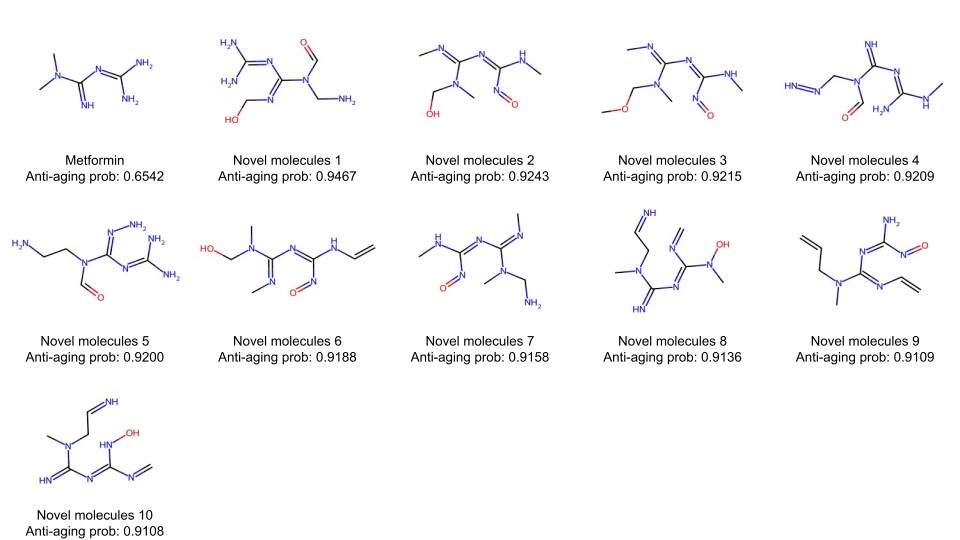

# Novel Caloric Restriction Mimetics (CRM) Generation Pipeline

Calorie restriction (CR) has been recognized as a beneficial practice for promoting healthy aging by preserving cellular function and extending the health span. To mimic the effects of caloric restriction, researchers have explored the use of Caloric Restriction Mimetics (CRMs), which are compounds that promote autophagy by modulating various cellular processes. While true CRMs that fully meet the required criteria are limited, there is a growing interest in identifying compounds with potential CRM properties. Here, we focus on generating novel molecules from CRMs, specifically focusing on metformin, a biguanide medication known for its ability to address age-related disorders and enhance overall health and lifespan, as metformin has gained significant attention and is currently being investigated in the clinical trial phase 4.

## Installation

1. Clone this repository:
```bash
git clone https://github.com/AnshulVerma01/Novel-CRM-Generation-Pipeline.git
```
2. Create a conda environment:
```bash
conda env create -f CRM.yml
conda activate CRM
```

## Usage
The primary script to run the pipeline is provided src/mutAIverse.py. Execute it directly by changing the respective file paths.
```python
python metgen.py
```

Demographic of top 10 scorer of novel generated CRM molecules from Metformin



## nohup.out File
The nohup.out file contains the output logs generated by the pipeline process. It captures all the standard output and warning messages from the pipeline execution, providing a detailed record of the process, including:

- Status updates of each step in the pipeline.
- Any warnings or errors encountered during execution.
- Final results or summaries produced by the pipeline.

This file serves as a reference for understanding the pipeline's execution and debugging any issues. If you wish to re-run the pipeline, you can follow the steps outlined in the Usage section of this repository.


**NOTE**: For running the pipeline, models for hallmarks of aging are required but we have not provided here yet as this project has not been published yet.
